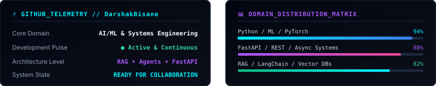

<div align="center">

  <!-- ==================== HERO BANNER ==================== -->
  <a href="https://github.com/DarshakBisane">
    
  </a>

  <br/><br/>

  <!-- Dynamic Typing Subheading -->
  <a href="https://github.com/DarshakBisane">
    
  </a>

  <br/><br/>

  <!-- Minimalist Social Icons -->
  <p align="center">
    <a href="https://github.com/DarshakBisane" target="_blank">
      
    </a>
    &nbsp;&nbsp;&nbsp;&nbsp;
    <!-- REPLACE 'YOUR-LINKEDIN-USERNAME' WITH YOUR ACTUAL LINKEDIN PROFILE SLUG -->
    <a href="https://linkedin.com/in/YOUR-LINKEDIN-USERNAME" target="_blank">
      
    </a>
    &nbsp;&nbsp;&nbsp;&nbsp;
    <!-- REPLACE 'your-email@example.com' WITH YOUR ACTUAL EMAIL -->
    <a href="mailto:your-email@example.com">
      
    </a>
  </p>

</div>

---

## 👨‍💻 About Me

```yaml
┌─────────────────────────────────────────────────────────────────────────────┐
│                             SYSTEM TELEMETRY                                │
├─────────────────────────────────────────────────────────────────────────────┤
│  Name       : Darshak Bisane                                                │
│  Degree     : B.Tech in Computer Engineering                                │
│  Role       : Aspiring AI / ML Engineer & Backend Developer                 │
│  Core Focus : Machine Learning • RAG • Autonomous Agents • MLOps             │
│  Stack      : Python 3.x • FastAPI • PyTorch • PostgreSQL • Docker          │
│  Location   : India 🇮🇳                                                      │
│  Mindset    : Build  →  Break  →  Analyze  →  Improve  →  Scale             │
└─────────────────────────────────────────────────────────────────────────────┘
```

---

## 🛠️ Technical Arsenal

<table align="center" width="100%">
  <tr>
    <td width="50%" valign="top">
      <h4>🧠 Machine Learning & AI</h4>
      <p><em>Neural Pipelines • Feature Engineering • NLP</em></p>
      <a href="https://skillicons.dev">
        
      </a>
      <br/><br/>
      <code>Python</code> • <code>PyTorch</code> • <code>Scikit-Learn</code> • <code>OpenCV</code> • <code>Pandas</code> • <code>NumPy</code> • <code>RAG</code>
    </td>
    <td width="50%" valign="top">
      <h4>🚀 Backend Architecture</h4>
      <p><em>High-Performance APIs • Async I/O • Microservices</em></p>
      <a href="https://skillicons.dev">
        
      </a>
      <br/><br/>
      <code>FastAPI</code> • <code>Python AsyncIO</code> • <code>RESTful APIs</code> • <code>Pydantic</code> • <code>Uvicorn</code>
    </td>
  </tr>
  <tr>
    <td width="50%" valign="top">
      <h4>🗄️ Databases & Storage</h4>
      <p><em>Relational Structures • In-Memory Caching</em></p>
      <a href="https://skillicons.dev">
        
      </a>
      <br/><br/>
      <code>PostgreSQL</code> • <code>Redis</code> • <code>SQLite</code> • <code>MongoDB</code> • <code>SQLAlchemy</code>
    </td>
    <td width="50%" valign="top">
      <h4>⚙️ DevOps, Tools & Web</h4>
      <p><em>Containerization • CI/CD • Tooling</em></p>
      <a href="https://skillicons.dev">
        
      </a>
      <br/><br/>
      <code>Docker</code> • <code>Git/GitHub</code> • <code>Linux/Bash</code> • <code>Postman</code> • <code>VS Code</code>
    </td>
  </tr>
</table>

---

## 🚀 Featured Projects

<table>
  <tr>
    <td width="50%" valign="top">
      <div align="left">
        <h3>🛡️ LaxmanRekha AI</h3>
        <p><strong>Intelligent Safety Perimeter & Vision Guardian</strong></p>
        <p>Computer vision system for dynamic hazard zone monitoring, boundary enforcement, and real-time anomaly detection.</p>
        <p>
          <code>Computer Vision</code> • <code>Python</code> • <code>FastAPI</code> • <code>OpenCV</code>
        </p>
        <p>
          <a href="https://github.com/DarshakBisane">
            <b>Explore Repository →</b>
          </a>
        </p>
      </div>
    </td>
    <td width="50%" valign="top">
      <div align="left">
        <h3>📊 Student Skill Gap Analyzer</h3>
        <p><strong>Data-Driven Career & Curriculum Intelligence</strong></p>
        <p>NLP & ML analytics platform mapping university curriculum against industry demand to recommend targeted learning paths.</p>
        <p>
          <code>NLP</code> • <code>Data Analytics</code> • <code>Python</code> • <code>Pandas</code>
        </p>
        <p>
          <a href="https://github.com/DarshakBisane">
            <b>Explore Repository →</b>
          </a>
        </p>
      </div>
    </td>
  </tr>
  <tr>
    <td width="50%" valign="top">
      <div align="left">
        <h3>🤖 Agentic Arena</h3>
        <p><strong>Autonomous Multi-Agent Orchestration</strong></p>
        <p>Modular simulation benchmark for coordinating, evaluating, and testing autonomous AI agents executing multi-step workflows.</p>
        <p>
          <code>AI Agents</code> • <code>RAG</code> • <code>LangChain</code> • <code>FastAPI</code>
        </p>
        <p>
          <a href="https://github.com/DarshakBisane">
            <b>Explore Repository →</b>
          </a>
        </p>
      </div>
    </td>
    <td width="50%" valign="top">
      <div align="left">
        <h3>⚡ Algorithmic & ML Core</h3>
        <p><strong>Mathematical Foundations & DSA</strong></p>
        <p>Optimized algorithmic solutions, data structure implementations, and foundational machine learning experiments built from scratch.</p>
        <p>
          <code>Algorithms</code> • <code>Math</code> • <code>NumPy</code> • <code>PyTorch</code>
        </p>
        <p>
          <a href="https://github.com/DarshakBisane">
            <b>Explore Repository →</b>
          </a>
        </p>
      </div>
    </td>
  </tr>
</table>

---

## 🧭 Learning Roadmap

<div align="center">
  
</div>

---

## ⚡ Currently Building

- ⚡ **RAG Architectures**: Engineering production-ready retrieval systems with hybrid search (BM25 + Dense embeddings).
- 🚀 **FastAPI Microservices**: Architecting high-concurrency asynchronous endpoints integrated with Redis queues.
- 🤖 **Autonomous Agents**: Experimenting with collaborative multi-agent swarms and tool-calling sandboxes.
- ⚙️ **MLOps & Deployment**: Containerizing inference pipelines with Docker for reproducible deployment.

---

## 💡 Developer Philosophy

```python
class Developer:
    def __init__(self):
        self.identity = "Darshak Bisane"
        self.status = "Student & ML/AI Engineer in Training"
        self.passions = ["Artificial Intelligence", "Clean Architecture", "Problem Solving"]

    def execute_lifecycle(self):
        """Infinite loop of deliberate engineering & innovation."""
        while True:
            concept = self.learn(domain="AI & Systems")
            system  = self.build(spec=concept, framework="FastAPI + PyTorch")
            anomalies = self.debug(system, depth="Root Cause")
            optimized = self.improve(system, metrics=["Latency", "Accuracy", "Reliability"])
            self.ship(optimized)
```

---

## 📈 GitHub Telemetry & Stats

<div align="center">
  
</div>

---

## 📬 Get in Touch

<div align="center">
  <p>Looking to collaborate on Machine Learning projects, RAG systems, or backend engineering? Let's connect!</p>
  
  <br/>
  
  <a href="https://github.com/DarshakBisane" target="_blank">
    
  </a>
  &nbsp;&nbsp;&nbsp;&nbsp;&nbsp;&nbsp;
  <!-- REPLACE 'YOUR-LINKEDIN-USERNAME' WITH YOUR ACTUAL LINKEDIN PROFILE SLUG -->
  <a href="https://linkedin.com/in/YOUR-LINKEDIN-USERNAME" target="_blank">
    
  </a>
  &nbsp;&nbsp;&nbsp;&nbsp;&nbsp;&nbsp;
  <!-- REPLACE 'your-email@example.com' WITH YOUR ACTUAL EMAIL -->
  <a href="mailto:your-email@example.com">
    
  </a>
</div>

<br/><br/>

<!-- ==================== FOOTER ==================== -->
<div align="center">
  
</div>