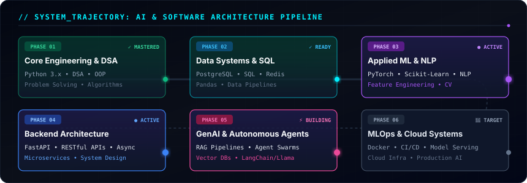

<div align="center">

  <!-- ==================== HERO BANNER ==================== -->
  <a href="https://github.com/DarshakBisane">
    
  </a>

  <br/><br/>

  <!-- Dynamic Typing Subheading -->
  <a href="https://github.com/DarshakBisane">
    
  </a>

  <br/>

  <!-- Status & Quick Uplink Pills -->
  <p align="center">
    <a href="https://github.com/DarshakBisane">
      
    </a>
    <a href="https://linkedin.com/in/YOUR-LINKEDIN-USERNAME">
      
    </a>
    <a href="mailto:your-email@example.com">
      
    </a>
  </p>

</div>

---

### 📡 `01 // DEVELOPER_IDENTITY.py`

```yaml
┌─────────────────────────────────────────────────────────────────────────────┐
│                             SYSTEM TELEMETRY                                │
├─────────────────────────────────────────────────────────────────────────────┤
│  Name       : Darshak Bisane                                                │
│  Degree     : B.Tech in Computer Engineering                                │
│  Role       : Aspiring AI / ML Engineer & Backend Developer                 │
│  Core Focus : Machine Learning • RAG • Autonomous Agents • MLOps             │
│  Stack      : Python 3.x • FastAPI • PyTorch • PostgreSQL • Docker          │
│  Location   : India 🇮🇳                                                      │
│  Mindset    : "Build  →  Break  →  Analyze  →  Improve  →  Scale"           │
│  Directive  : Bridging mathematical models with high-throughput backend APIs│
└─────────────────────────────────────────────────────────────────────────────┘
```

---

### ⚡ `02 // NEURAL & TECHNICAL ARCHITECTURE`

<table align="center" width="100%">
  <tr>
    <td width="50%" valign="top">
      <h4>🧠 Artificial Intelligence & Machine Learning</h4>
      <p><em>Modeling • Feature Engineering • Neural Pipelines • NLP</em></p>
      <a href="https://skillicons.dev">
        
      </a>
      <br/>
      <code>NumPy</code> • <code>Pandas</code> • <code>PyTorch</code> • <code>Scikit-Learn</code> • <code>OpenCV</code> • <code>HuggingFace</code> • <code>RAG</code>
    </td>
    <td width="50%" valign="top">
      <h4>🚀 Backend & Systems Engineering</h4>
      <p><em>High-Performance APIs • Async I/O • Microservices</em></p>
      <a href="https://skillicons.dev">
        
      </a>
      <br/>
      <code>FastAPI</code> • <code>Python AsyncIO</code> • <code>RESTful APIs</code> • <code>Pydantic</code> • <code>Uvicorn</code>
    </td>
  </tr>
  <tr>
    <td width="50%" valign="top">
      <h4>🗄️ Databases & Caching</h4>
      <p><em>Relational Structures • In-Memory Caching • Query Optimization</em></p>
      <a href="https://skillicons.dev">
        
      </a>
      <br/>
      <code>PostgreSQL</code> • <code>Redis</code> • <code>SQLite</code> • <code>MongoDB</code> • <code>SQLAlchemy</code>
    </td>
    <td width="50%" valign="top">
      <h4>⚙️ DevOps, Cloud & Tooling</h4>
      <p><em>Containerization • Version Control • Linux Environments</em></p>
      <a href="https://skillicons.dev">
        
      </a>
      <br/>
      <code>Docker</code> • <code>Git/GitHub</code> • <code>Linux/Bash</code> • <code>Postman</code> • <code>VS Code</code>
    </td>
  </tr>
  <tr>
    <td colspan="2" valign="top">
      <h4>🌐 Frontend & Interface Prototyping</h4>
      <p><em>Interactive UIs • Responsive Dashboards • Data Visualization</em></p>
      <a href="https://skillicons.dev">
        
      </a>
      <br/>
      <code>HTML5</code> • <code>CSS3</code> • <code>JavaScript (ES6+)</code> • <code>React</code> • <code>TailwindCSS</code>
    </td>
  </tr>
</table>

---

### 🛸 `03 // FEATURED NEURAL SYSTEMS & PROJECTS`

<table>
  <tr>
    <td width="50%" valign="top">
      <div align="left">
        <h3>🛡️ LaxmanRekha AI</h3>
        <p><strong>Intelligent Safety Perimeter & Vision Guardian</strong></p>
        <p>An intelligent computer vision and perimeter surveillance system designed for dynamic hazard zone monitoring, boundary enforcement, and real-time anomaly alerts.</p>
        <p>
          
          
        </p>
        <ul>
          <li><strong>Core Problem:</strong> High latency and false triggers in traditional perimeter surveillance.</li>
          <li><strong>Architecture:</strong> Spatial boundary tracking, automated event detection, and real-time dispatch alerts.</li>
        </ul>
        <p>
          <a href="https://github.com/DarshakBisane">
            
          </a>
        </p>
      </div>
    </td>
    <td width="50%" valign="top">
      <div align="left">
        <h3>📊 Student Skill Gap Analyzer</h3>
        <p><strong>Data-Driven Career & Curriculum Intelligence</strong></p>
        <p>An AI/ML analytics engine that scans industry job requirements against student curricula to extract skill discrepancies and map customized learning roadmaps.</p>
        <p>
          
          
        </p>
        <ul>
          <li><strong>Core Problem:</strong> Disconnect between university syllabus and modern industry tech stacks.</li>
          <li><strong>Architecture:</strong> Semantic resume parsing, vector-based competency clustering, and skill gap visualization.</li>
        </ul>
        <p>
          <a href="https://github.com/DarshakBisane">
            
          </a>
        </p>
      </div>
    </td>
  </tr>
  <tr>
    <td width="50%" valign="top">
      <div align="left">
        <h3>🤖 Agentic Arena</h3>
        <p><strong>Autonomous Multi-Agent Orchestration & Reasoning</strong></p>
        <p>A modular benchmark and simulation environment for coordinating, testing, and evaluating autonomous AI agents executing complex multi-step reasoning tasks.</p>
        <p>
          
          
        </p>
        <ul>
          <li><strong>Core Problem:</strong> Agent tool hallucination and non-deterministic task coordination.</li>
          <li><strong>Architecture:</strong> ReAct framework, structured state memory, tool-calling interfaces, and consensus protocols.</li>
        </ul>
        <p>
          <a href="https://github.com/DarshakBisane">
            
          </a>
        </p>
      </div>
    </td>
    <td width="50%" valign="top">
      <div align="left">
        <h3>⚡ Algorithmic & ML Core</h3>
        <p><strong>Mathematical Foundations, DSA & Model Experiments</strong></p>
        <p>Curated repository of optimized algorithmic solutions, advanced data structure implementations, and foundational machine learning experiments built from scratch.</p>
        <p>
          
          
        </p>
        <ul>
          <li><strong>Core Problem:</strong> Deep algorithmic understanding of computational complexity and tensor math.</li>
          <li><strong>Architecture:</strong> Clean modular implementations of trees, graphs, dynamic programming, and gradient descent.</li>
        </ul>
        <p>
          <a href="https://github.com/DarshakBisane">
            
          </a>
        </p>
      </div>
    </td>
  </tr>
</table>

---

### 🗺️ `04 // LEARNING TRAJECTORY & ROADMAP`

<div align="center">
  
</div>

<br/>

```text
  [01. FOUNDATIONS]      [02. DATA SYSTEMS]       [03. APPLIED ML]       [04. BACKEND]         [05. GENAI/AGENTS]     [06. MLOPS & CLOUD]
  ├── Python 3.x         ├── PostgreSQL           ├── Scikit-Learn       ├── FastAPI           ├── RAG Pipelines      ├── Docker & K8s
  ├── DSA Patterns       ├── Redis Cache          ├── PyTorch Tensors    ├── Async I/O         ├── Autonomous Agents  ├── CI/CD Workflows
  └── System Design      └── Pandas Pipelines     └── NLP Transformers   └── Microservices     └── Vector Databases   └── Model Serving
```

---

### 📡 `05 // ACTIVE TELEMETRY (CURRENTLY BUILDING)`

```python
# System Status: Real-time active focus areas
current_telemetry = {
    "01_focus": "Engineering production-ready RAG architectures with hybrid search (BM25 + Dense)",
    "02_focus": "Building high-concurrency FastAPI microservices integrated with Redis queues",
    "03_focus": "Experimenting with multi-agent collaborative workflows and tool execution sandboxes",
    "04_focus": "Sharpening DSA, dynamic programming, and competitive problem-solving patterns",
    "05_focus": "Containerizing ML inference engines with Docker for scalable deployment"
}
```

---

### 🧬 `06 // DEVELOPER PHILOSOPHY`

```python
class Developer:
    def __init__(self):
        self.identity = "Darshak Bisane"
        self.status = "Student & ML/AI Engineer in Training"
        self.passions = ["Artificial Intelligence", "Clean Architecture", "Problem Solving"]

    def execute_lifecycle(self):
        """Infinite loop of deliberate engineering & innovation."""
        while True:
            concept = self.learn(domain="AI & Systems")
            system  = self.build(spec=concept, framework="FastAPI + PyTorch")
            anomalies = self.debug(system, depth="Root Cause")
            optimized = self.improve(system, metrics=["Latency", "Accuracy", "Reliability"])
            self.ship(optimized)

# [SYSTEM]: Process initialized with PID 4040. Continuous execution enabled.
```

---

### 📊 `07 // GITHUB TELEMETRY & ANALYTICS`

<div align="center">
  <table border="0" style="border: none;">
    <tr>
      <td align="center" style="border: none;">
        
      </td>
      <td align="center" style="border: none;">
        
      </td>
    </tr>
    <tr>
      <td colspan="2" align="center" style="border: none;">
        
      </td>
    </tr>
  </table>
</div>

---

### 🌐 `08 // TRANSMISSION & UPLINK`

<div align="center">
  <p>Looking to collaborate on Machine Learning projects, RAG systems, or backend engineering? Reach out!</p>
  
  <a href="https://github.com/DarshakBisane">
    
  </a>
  &nbsp;&nbsp;
  <!-- REPLACE 'YOUR-LINKEDIN-USERNAME' WITH YOUR ACTUAL LINKEDIN PROFILE SLUG -->
  <a href="https://linkedin.com/in/YOUR-LINKEDIN-USERNAME">
    
  </a>
  &nbsp;&nbsp;
  <!-- REPLACE 'your-email@example.com' WITH YOUR ACTUAL EMAIL -->
  <a href="mailto:your-email@example.com">
    
  </a>
</div>

<br/>

<!-- ==================== FOOTER ==================== -->
<div align="center">
  
</div>
# DarshakBisane

